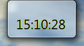

# TimeControlAero - 时钟小工具 Aero 版

## 关于本项目

这是一个支持Aero背景的简单时钟小工具，面前处于开发阶段，存在一些Bugs。建议在 Windows 7 上使用以获得最佳体验，其它系统建议使用[TimeControl](https://github.com/cjhdevact/TimeControl)时钟小工具程序。

Aero 实现原理是调用`dwmapi.dll`来实现扩展标题栏的窗口框架到整个窗口，所以理论上显示的背景与你的窗口标题栏显示背景有关。所以在 Windows 11 使用可能可以将标题栏的云母效果扩展到整个窗口。

## 功能

本程序支持的功能有：

- [x] 显示时间（基础功能）
- [x] Aero 主题
- [ ] 其它一些功能，敬请期待……

## 下载

转到[发布页](https://github.com/cjhdevact/TimeControlAero/releases)下载程序或源代码。

## 程序截图

主程序界面

## 开源说明

在修改和由本仓库代码衍生的代码中需要说明“基于 TimeControlAero 开发”

------------

本程序基于 `GPL-3.0` 授权。